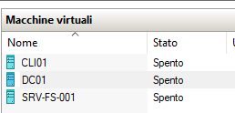
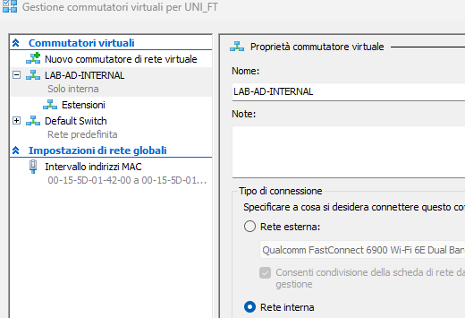
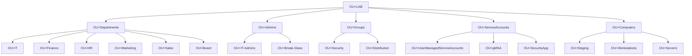
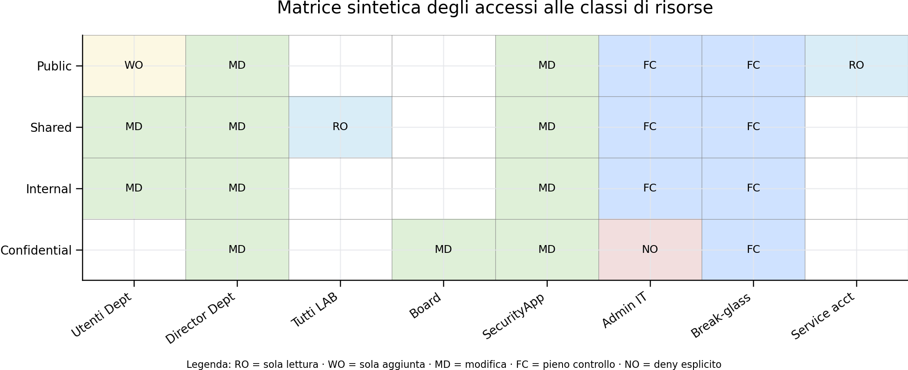
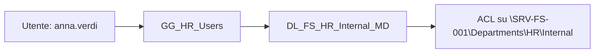

# Progetto Active Directory - Security

## 1. Premesse e contesto
Questa presentazione si articola in 6 capitoli che ricalcano grosso modo le 6 fasi di lavoro seguite:

1. [Premessa](#1-premesse-e-contesto) - indicazioni di carattere generale e approccio
2. [Set-Up](#2-set-up) - la messa in opera delle VM e l'attivazione del Dominio/Foresta
3. [Progettazione](#3-progettazione) - la definizione del contesto e dei requisiti
4. [Design](#4-design) - la descrizione, poi confluita in un runbook esterno, di come applicare i requisiti all'infrastruttura data, al fine di raggiungere gli obbiettivi assegnati
5. [Deploy](#5-deploy) - la descrizione di quanto prodotto con l'applicazione del runbook
6. [Relazione e Allegati](#6-allegati) - raccoglie tutto quanto non incluso in questo documento
    - Runbook e Script utilizzati
    - Piano di test (honey-object, Kerberoasting e SilverTicket)
    - Evidenze prodotte dai test

<br>

---

### 1.1 Metodologia AGILE
Trattandosi di un progetto di cui avevo solo una idea generale, ho preferito procedere per prototipazioni successive, da testare ed incrementare fino a raggiungere un risultato che ritengo possa essere presentato in sede di esame

 1. Progettazione teorica e studio dell'architettura AD "ideale"
 2. Deploy dell'ambiente proposto nella traccia d'esame
 3. Merge del'ambiente "LAB" nell'architettura AD appena deployata
 4. Definizione ed esecuzione di un piano di test "generico" per la validazione dell'ambiente AD
 5. Esecuzione nell'ambiente AD d'esame degi esercizi (simulazioni di attacco) proposte in LAB

<br>

---

### 1.2 Presentazione dei risultati

Al fine di non rendere la struttura del documento troppo più lunga, complessa e ridondante,questa relazione e presenterà solo lo stato finale di ogni fase.  
Ad esempio, dove un test ha evidenziato una anomalia e questa è stata corretta, il capitolo di Deploy riporta già il risultato finale.  

Si fa riferimento ad allegati specifici per approfondire varie fasi, risultati dei test, ecc. 


La relazione, fornita come richiesto anche in formato PDF, è predisposta per essere fruita e navigata in markdown (scaricando il relativo ZIP o direttamente in https://github.com/tiralongofabio/Progetto-UNIBO-AD )

```text
├───Runbook
├───DeployScript
├───PianoDiTest
│   ├───Scripts
│   └───Esiti
│       ├───Evidenze
│       └───Alerts
└───img
```

---

### 1.3 Obiettivi

**Lo Scopo** è quello di modellare una Organizzazione "**LAB**", secondo le migliori pratiche di Active Directory, applicando e replicando gli step proposti nella traccia di esame, completi della parte (facoltativa) relativa al test sull'**Honey-Object**.


**La Scelta** di questa traccia in particolare nasce dal fatto che, oltre 20 anni fa, ho iniziato l'attività in informatica come sistemista e durante questo percorso di laurea ci sono state poche occasioni di lavorare su questo ambito, piuttosto che sulla sola programmazione. Inoltre, parto da una certificazione Microsoft (Windows Server 2012) presa nel 2013, che già ne seguiva una più ampia come Sistemista Windows del 2009; in entrambi i casi avevo dato poco spazio alla parte di Active Directory e PowerShell, così questa si presenta come l'occasione perfetta per colmare questi GAP.

> Il risultato sarà un mix di quanto appreso durante il corso, di quanto visto nell'attività lavorativa e di quello che imparerò "hands on", durante lo svolgimento dei questo progetto.

---


### 1.4 Il ricorso alla AI
L'idea di partenza è quella di utilizzarla il meno possibile e di basarmi sul materiale a disposizione online (https://learn.microsoft.com/) e su un buon vecchio Manuale cartaceo (windows server 2008R2)

Come da indicazioni ricevute, riporto puntualmente dove sono ricorso a strumenti AI e i prompt utilizzati.

Sicuramente, siccome sto scrivendo questa relazione direttamente in markdown, a fine lavoro ne farò fare una revisione alla AI, ma solo per ripulire il testo da eventuali errori di battitura e verificare la formattazione;
in un [capitolo ad hoc](#revisione-finale) riporto le modifiche applicate.

Aggiornamento: a fine progetto posso dire che lo strumento AI (ho usato soprattutto Copilot con GPT 5.5) si è rivelato particolarmente utile ed efficacie nella produzione degli script poweshell e nell'analisi, spiegazione ed indagine delle anomlaie che ho incontrato durante il percorso.  
Particolarmente interessante il fatto che Copilot per default rigetti la possibilità di produrre "in row" una guida completa per testare gli attacchi previsti o altri che ho proposto; in ogni caso, passandogli del materiale appositamente predisposto, il controllo è stato superato e non ha avuto nessuna remora nel supportarmi in ogni fase dell'esecuzione delle diverse simulazioni di attacco.

---

### 1.5 Risorse disponibili

**Tempo**: Poco. Studente lavoratore con famiglia, ecc. Seguo le lezioni esclusivamente online e posso studiare e lavorare a questo progetto solo nel week-end e durante la notte (non è un problema: ho già dato tutti gli altri esami così).

**HW**: (provato sul muletto di casa, poi ho dovuto optare per una soluzione diversa)  
 HP EliteBook 645 G9
- AMD Ryzen 5 PRO 5675U (6 core; 12 vCPU)
- RAM 16 GB

A differenza di quanto potrei fare in un ambiente enterprise, dove in su Windows mi sono sempre appoggiato molto alle componenti grafiche e ai vari wizard, qui dovrò lavorare tramite PowerShell e sicuramente **ricorrerò alla AI per tradurre le attività che avrei fatto da GUI in comandi PowerShell**.

**Licencing**: le *"Evaluation Version"* hanno validità e durata limitate a 180 giorni per il server e 90 per il client. Dovrò completare e presentare il Progetto entro questi termini.


Aggiornamento a fine progetto: la macchina si è prestata bene al lavoro in questione; la RAM è stata sufficiente per lavorare con 3 macchine in parallelo; avrei potuto forse metterne un altra in linea, se necessario, rinunciando all'interfaccia grafica del DC, ma DC, Client e FileServer sono risultati sufficienti per eseguire compiutamente tutte le attività e i test previsti.

---
---

<br>


## 2. Set-Up

Le macchine che andrò ad utilizzare sono
- **DC**: Windows Server 2022 Evaluation
- **FileServer**: Windows Server 2022 Evaluation
- **Client**: Windows 11 Evaluation

<br>

> In ogni caso la soluzione AD dovrà essere disegnata per poter gestire l'aggiunta di ulteriori server e workstation

<br>

---

### 2.1 Virtualizzatore
Una Infrastruttura 100% Windows con Hyper-V!



---

### 2.2 Virtual Switch



Si tratta di una rete virtuale e interna, così che l'ambiente di test rimanga isolato rispetto alla rete internet, ma anche dalla rete locale (domestica) e perfino, per quanto possibile, dall'host da cui sto eseguendo la virtualizzazione
... per reciproca sicurezza

---
---

<br>


## 3 Progettazione

*Logiche, OU, gruppi, GPO e modello di accesso*

Ampia parte del tempo dedicato al progetto si è concentrata nel design del modello organizzativo e della conseguente della struttura AD da implementare.  
In questa fase e capitolo riporto il set-up immaginato inizialmente, mentre nella parte di deploy si rappresenta l'architettura effettivamente implementata, quanto possibile tentando di avvicinarsi a questo modello e considerando i principi e i vincoli e le reiterazioni applicate di volta in volta, prima di arrivare al risultato definitivo.

---

<br>


### 3.1 Principi di progettazione applicati

#### Segregazione dei ruoli
- un **account standard** per le attività quotidiane di ogni utente;
- un **account amministrativo separato** solo per attività elevate.

<br>

#### Minimo privilegio
- I privilegi saranno assegnati per **funzione** e **ambito**, evitando di concedere permessi ampi in modo permanente e indiscriminato.

<br>


#### Astrazione
- Nessun permesso diretto ai singoli utenti.

<br>

#### Modularità
- GPO granulari, leggibili, riutilizzabili e collegate all'OU più alta possibile compatibile con il requisito.

---

<br>


### 3.2 Popolazione e ruoli

#### OU = LAB
**Dipartimenti operativi (5):**
- IT
- Finance
- HR
- Marketing
- Sales

<br>

**Unità di governance (1):**
- Board

#### Account previsti
- **24 utenti standard**: `nome.cognome` (4 per ogni UO)
- **4 account admin IT**: `admin.nome.cognome` (secondo utente per i membri di UO "IT", autorizzati)
- **1 account break-glass**: `super.user` (SU, cutodito offline)
- **1 honey object**: `admin.backup` (limitato per logging test)

#### Ruoli logici
- **Employee**
- **Director**
- **Board**
- **Admin IT**
- **Break-glass**
- **Service account / gMSA** (Group Managed Service Accounts)
- **Honey object**


#### **Account speciali**

##### Account admin separati

- riduzione del rischio di phishing e credential exposure;
- tracciabilità delle azioni elevate;
- migliore applicazione del principio di minimo privilegio.

##### Break-glass

- account separato;
- credenziali custodite offline;
- uso solo in emergenza o recovery;
- monitoraggio dedicato;
- nessun utilizzo quotidiano.

##### Honey object "admin.backup"
- utilizzato unicamento per simulazione di attacco;
- **non** possiede reali privilegi elevati;
- è monitorato con auditing dedicato;
- generare alert in caso di tentativo di logon o group membership change.

<br>

> Nota: il ruolo **Director** è un attributo funzionale assegnato tramite gruppo, non una OU separata per ogni singolo utente.

---

### 3.3 Naming convention

#### Abbreviazioni principali
- `LAB` = organizzazione / perimetro del laboratorio
- `GG` = Global Group
- `DL` = Domain Local Group
- `OU` = Organizational Unit
- `WS` = Workstation
- `SRV` = Server
- `FS` = File Server
- `DB` = Database Server
- `FE` = Front-End Server
- `APP` = Application Server
- `RO` = Read Only
- `WO` = Write Only / sola aggiunta
- `MD` = Modify
- `FC` = Full Control
- `NO` = Deny esplicito

#### Utenti
- Standard: `nome.cognome`
- Admin: `admin.nome.cognome`
- Break-glass: `super.user`
- Honey object: `admin.backup`

#### Computer
- Workstation: `WS-<DEPT>-###`  
  esempi: `WS-HR-001`, `WS-IT-002`
- Member server: `SRV-<ROLE>-###`  
  esempi: `SRV-FS-001`, `SRV-DB-001`, `SRV-APP-001`
- Eccezioni di laboratorio:
  - `DC01` = Domain Controller
  - `CLI01` = client iniziale di test

#### Gruppi
**Global group (identità/ruoli) di esempio:**
- `GG_LAB_AllUsers`
- `GG_IT_Users`
- `GG_HR_Users`
- `GG_Finance_Users`
- `GG_Marketing_Users`
- `GG_Sales_Users`
- `GG_Board_Members`
- `GG_LAB_Directors`
- `GG_LAB_Admins`

**Domain local group (permessi) di esempio:**
- `DL_FS_HR_Internal_MD`
- `DL_FS_HR_Confidential_MD`
- `DL_FS_Sharing_All_RO`
- `DL_RDP_SRV-APP-001_Admins`

---
---

<br>


## 4. Design

Lo scopo di questo capitolo è quello di descrivere e strutturare meglio quanto definito/immaginato in progettazzione e di modificare, correggere, evolvere l'ambiente AD così definito.

L'obiettivo è quello di poter iterare elaborazioni di questo singolo capitolo al fine di realizzare un [Runbook "definitivo"](./Runbook/LAB-AD-Runbook-Aggiornato.md) che lo strumento AI potrà utilizzare per generare tutti gli script necessari per il deploy e i relativi test (tipo unit-test)

Il Capitolo successivo descriverà invece lesito dell'applicazione del Runbook; in questo modo, anche se appare ridondante, questa relazione può mostrare pedissequamente il processo creativo e il tutto il percorso che ha portato alla realizzazione dell'ambiente Active Directory richiesto.

---

### 4.1 Overview
- `OU=Departments` ospita le **identità utente standard**.
- `OU=Admins` ospita gli **account amministrativi separati**.
- `OU=Groups` migliora ordine, governance e delega.
- `OU=ServiceAccounts` ospita account applicativi o **gMSA**.
- `OU=Computers\Servers` ospita **member server**, non Domain Controller.
- I **Domain Controller** rimangono nella OU predefinita **Domain Controllers**.

### Struttura logica

**Radice logica:** `OU=LAB`



---


### 4.2 Modello Gruppi

#### Logica **AGDLP**
- **A**ccounts → dentro **G**lobal groups
- Global groups → dentro **D**omain **L**ocal groups
- **P**ermessi assegnati solo ai domain local groups

#### Esempio base
- `anna.verdi` ∈ `GG_HR_Users`
- `GG_HR_Users` ∈ `DL_FS_HR_Internal_MD`
- La cartella `\\SRV-FS-001\Departments\HR\Internal` assegnata in **Modify** a `DL_FS_HR_Internal_MD`

#### Esempio Director
- `luca.neri` ∈ `GG_LAB_Directors`
- `GG_LAB_Directors` ∈ `DL_FS_HR_Confidential_MD`
- `GG_Board_Members` ∈ `DL_FS_HR_Confidential_MD`


---

### 4.3 Classificazione delle risorse

Per ogni dipartimento si definiscono quattro classi logiche di risorsa.

**Public/Drop-Box**  
Uso: condivisione ampia, distribuzione, pubblicazione, ecc..
- `WO` → utenti del dipartimento
- `MD` → Director del dipartimento e `SecurityApp`
- `RO` → service account, se necessario
- `FC` → break-glass
- `FC` → admin IT

<br>

**Shared**  
Uso: area collaborativa trasversale.
- `RO` → tutti gli utenti LAB
- `MD` → Utenti e Director del dipartimento, `SecurityApp`
- `FC` → break-glass
- `FC` → admin IT

<br>

**Internal**  
Uso: documentazione e lavoro interno del dipartimento.
- `MD` → Utenti e Director del dipartimento, `SecurityApp`
- `FC` → break-glass
- `FC` → admin IT

<br>

**Confidential**  
Uso: dati ad alta riservatezza.
- `MD` → Director del dipartimento, Board, `SecurityApp`
- `NO` → admin IT non inclusi per default
- `FC` → break-glass


---

### 4.4 Struttura delle Share

#### File server di esempio
`SRV-FS-001`

```text
\SRV-FS-001\Departments
├── IT
│   ├── Public
│   ├── Shared
│   ├── Internal
│   └── Confidential
├── Finance
│   ├── Public
│   ├── Shared
│   ├── Internal
│   └── Confidential
├── HR
│   ├── Public
│   ├── Shared
│   ├── Internal
│   └── Confidential
├── Marketing
│   ├── Public
│   ├── Shared
│   ├── Internal
│   └── Confidential
└── Sales
│   ├── Public
│   ├── Shared
│   ├── Internal
│   └── Confidential
│
\SRV-FS-001\Shared`
```

<br>

> NB: NON assegno ACL direttamente ai singoli utenti, ma solo ai gruppi.


---

### 4.5 Definizione delle GPO

#### Macro-categorie
1. **Baseline Computers** → firewall, auditing di base, impostazioni comuni
2. **Baseline Users** → lock screen, hardening base lato utente
3. **Workstations** → hardening endpoint, update policy, restrizioni device
4. **Servers** → hardening server, RDP/NLA, auditing avanzato
5. **Departmental** → drive mapping e impostazioni specifiche utente
6. **Admins** → restrizioni dedicate agli account amministrativi
7. **Staging** → policy temporanee di onboarding / test

#### Esempi di GPO
- `GPO-LAB-Baseline-Computers`
- `GPO-LAB-Baseline-Users`
- `GPO-LAB-Workstations-Hardening`
- `GPO-LAB-Servers-Hardening`
- `GPO-LAB-Admins-Restrictions`
- `GPO-LAB-DriveMap-HR`
- `GPO-LAB-Staging-Quarantine`

#### Esempi di Linking
- `GPO-LAB-Baseline-Computers` → `OU=LAB\Computers`
- `GPO-LAB-Workstations-Hardening` → `OU=LAB\Computers\Workstations`
- `GPO-LAB-Servers-Hardening` → `OU=LAB\Computers\Servers`
- `GPO-LAB-Admins-Restrictions` → `OU=LAB\Admins`
- `GPO-LAB-Baseline-Users` → `OU=LAB\Departments`


<br>

> NB: Non uso la **Default Domain Policy**, se non per i criteri realmente di dominio.


---

### 4.6 Esempi/Demo dell'implemntazione prevista
**Matrice degli accessi**  


---

**Flusso AGDLP**  
Esempio:


---


**Esempio HR\Internal**  
> Gli utenti HR devono modificare la cartella interna del dipartimento.

1. Creazione gruppo identità: `GG_HR_Users`
2. Creazione gruppo permessi: `DL_FS_HR_Internal_MD`
3. Nesting: `GG_HR_Users` → `DL_FS_HR_Internal_MD`
4. ACL sulla cartella `\SRV-FS-001\Departments\HR\Internal` → `Modify` a `DL_FS_HR_Internal_MD`

<br>

---

**Esempio HR\Confidential**  
> I dati HR confidential devono essere accessibili solo a HR Director, Board e break-glass.

1. `GG_HR_Director`
2. `GG_Board_Members`
3. `DL_FS_HR_Confidential_MD`
4. Nesting:
   - `GG_HR_Director` → `DL_FS_HR_Confidential_MD`
   - `GG_Board_Members` → `DL_FS_HR_Confidential_MD`
5. ACL sulla cartella:
   - `Modify` → `DL_FS_HR_Confidential_MD`
   - `Full Control` → gruppo break-glass dedicato
   - deny / assenza di membership per admin IT standard

---

**Esempio Drive mapping**  
- Tutti gli utenti LAB:
  - `S:` → `\SRV-FS-001\Shared`
- Utenti HR:
  - `H:` → `\SRV-FS-001\Departments\HR\Internal`


<br>

---
---

<br>


## 5. Deploy

Questo capitolo rappresenta il set-up e tutte le configurazioni effettivamente applicate;  
anche se può apparire ridondante, rispetto ai capitoli precedenti, questa struttura documentale è coerente con l'obiettivo di rappresentare compiutamente l'intero processo creativo.  

Sintesi di cosa/come è stato applicato, può essere analizzata andando direttamente al [Runbook](./Runbook/LAB-AD-Runbook-Aggiornato.md).


> NB: nel procedere con l'analisi e il deploy ha sempre più preso piede e spazio l'idea di predisporre sì un ambiente minimale, ma anche tutte le policy necessarie alla successiva aggiunta (potenziale) di nuove macchine e utenti al Dominio AD.


---


### 5.1 VM
**Primo Domain Controller** \[DC01]:
- Windows Server 2022
- 3 CPU
- 2 GB RAM
- 1 VHD

<br>

**Prima WorkStation** \[CLI01]:
- MS Windows 11
- 4 CPU
- RAM dinamica 2-5 GB
- 1 VHD

<br>

**Primo FileServer** \[SRV-FS-001]:
- Windows Server 2022
- 2 CPU
- 2 GB RAM
- 2 VHD (uno dedicato alle Share di AD)

---


###  5.2 Configurazione dell'ambiente Active Directory

Grazie al materiale fornito nel laboratorio è stato molto semplice configurare DC, Client e il primo Server, il dominio AD, unire tutte la macchine nella realtiva Foresta, ecc.

Gli script utilizzati per i deploy descritti da qui in poi sono stati generati utilizzando "Copilot" [m365.cloud.microsoft] con GPT 5.5, in 3 semplici step:
1. generazione di un RunBook allegando capitolo di [Design](#4-design) di questo documento
2. interazioni e iterazioni reiterate sul RunBook, con relativa revisione del capitolo 4
3. generazione, test e revisione degli script, fino ad arrivare alla loro [versione finale](./Runbook/LAB-AD-Runbook-Aggiornato.md)

<br>

---

### 5.3 Regole Firewall


#### Regole generali per tutte le macchine

- Firewall abilitato
- Traffico inbound bloccato di default
- Traffico outbound consentito di default
- Apertura esplicita solo dei servizi necessari

<br>

> In una prima fase di test ho applciato le regole firewall alle 3 macchine create e già collegate; a seguire ho definito le GPO (Firewall) che si applicheranno alle macchine aggiunte successivamente

---

#### Regole Firewall per DC01 - Domain Controller

`DC01` è il Domain Controller del dominio `ad-lab-domain.local` e ospita anche il servizio DNS di dominio.  
Le regole firewall applicate a `DC01` hanno l'obiettivo di consentire solo i servizi necessari al corretto funzionamento di Active Directory, DNS, autenticazione e gestione del dominio.

**Baseline firewall:**
- Firewall attivo su tutti i profili
- Inbound default: Block
- Outbound default: Allow


<br>

**Funzione DNS:**
- consente ai client e ai server membri del laboratorio di interrogare il DNS su `DC01`.

<br>

> **Motivazione:** Senza DNS verso il DC, join al dominio, logon e GPO non funzionano correttamente.


<br>

**Funzioni specifiche AD/DC:**

- LAB-DC-Allow-Kerberos-TCP-88-From-Lab (Kerberos)
- LAB-DC-Allow-Kerberos-UDP-88-From-Lab (LDAP)
- LAB-DC-Allow-LDAP-TCP-389-From-Lab
- LAB-DC-Allow-LDAP-UDP-389-From-Lab
- LAB-DC-Allow-SMB-TCP-445-From-Lab (SMB, SYSVOL, NETLOGON)
- LAB-DC-Allow-RPC-TCP-135-From-Lab (RPC Endpoint Mapper)
- LAB-DC-Allow-NTP-UDP-123-From-Lab (NTP / sincronizzazione oraria)
- LAB-DC-Allow-GC-TCP-3268-From-Lab Global Catalog


> per autenticazione, interrogazione directory, accesso a SYSVOL/NETLOGON e sincronizzazione oraria. La loro apertura è limitata alla subnet del laboratorio, evitando esposizioni non necessarie.

<br>


**Controllo Remoto (RDP)**
- LAB-DC-Allow-RDP-3389-From-AdminSources 

> Consente accesso RDP a DC01 solo da indirizzi amministrativi autorizzati (CLI01). CLI01 poterebbe essere la workstation di uni degli admin IT. RDP verso un Domain Controller è strettamente limitato. Il firewall controlla la provenienza di rete, mentre l'autorizzazione utente rimane gestita tramite gruppi amministrativi di Windows/Active Directory.


<br>

**Ping per Test e Lab:**

- LAB-DC-Allow-ICMPv4-From-Lab

> **ICMP diagnostico:** consente ping IPv4 verso DC01 dalla rete del laboratorio. Utile per verificare rapidamente raggiungibilità e problemi di rete durante il deploy e il troubleshooting.


<br>


---

#### Regole Firewall per SRV-FS-001 - File Server
`SRV-FS-001` è il member server dedicato alle share SMB del laboratorio.
Le regole firewall su `SRV-FS-001` devono consentire accesso ai file condivisi e amministrazione remota, limitando il resto.

**Baseline firewall:**
- Firewall attivo su tutti i profili
- Inbound default: Block
- Outbound default: Allow

<br>

> il file server espone servizi specifici verso i client. Tutto il traffico inbound non esplicitamente autorizzato deve restare bloccato.


<br>

**Funzioni specifiche File Server (SMB):**

- LAB-FS-Allow-SMB-445-From-Lab

Share interessate:
```text
\\SRV-FS-001\Departments
\\SRV-FS-001\Governance
\\SRV-FS-001\Shared
```
> Motivazione: SMB è necessario per l'accesso alle cartelle condivise. L'apertura è limitata alla subnet del laboratorio.


<br>

**Controllo Remoto (RDP)**
- LAB-FS-Allow-RDP-3389-From-AdminSources

Consente accesso RDP a `SRV-FS-001` solo dalle sorgenti amministrative autorizzate (la "WorkStation" CLI01).
> Motivazione: accesso da parte degli utenti amministrativi (solo per attività amministrative interattive).


<br>

**Amministrazione Remota (WinRM)**
- LAB-FS-Allow-WinRM-5985-From-DC01

Consente amministrazione remota PowerShell di `SRV-FS-001` da `DC01`.

> Motivazione: per la gestione automatica (es. da script) di file, cartelle, ACL e share, a partire dal Domain Controller (via Invoke-Command").


<br>

**Ping per Test e Lab:**

- LAB-DC-Allow-ICMPv4-From-Lab

> **ICMP diagnostico:** consente ping IPv4 verso DC01 dalla rete del laboratorio. Utile per verificare rapidamente raggiungibilità e problemi di rete durante il deploy e il troubleshooting.


---

#### Regole Firewall per CLI01 - Prima Workstation
`CLI01` è la workstation/client usata per testare logon dominio, accesso alle share, applicazione GPO e comportamento degli utenti.
Per `CLI01` la logica firewall è più restrittiva rispetto ai server: una workstation non deve esporre servizi server in ingresso.


**Baseline firewall:**
- Firewall attivo su tutti i profili
- Inbound default: Block
- Outbound default: Allow

<br>

> una workstation deve poter iniziare connessioni verso i servizi di dominio e verso il file server, ma non deve accettare connessioni inbound non necessarie.

<br>

**Ping per Test e Lab:**

- LAB-WS-Allow-ICMPv4-From-Lab

> Utile per verificare rapidamente raggiungibilità e problemi di rete durante il deploy e il troubleshooting.


<br>

---

### 5.4 Regole Firewall da GPO

Oltre alle regole applicate alle macchine già esistenti, ho predisposto GPO firewall per classi di computer.  

Applicate per classe di macchina, i nuovi Domain Controller, workstation, file server, app server o database server ereditano automaticamente la configurazione corretta, in base alla OU di appartenenza. 

> Questo approccio evita configurazioni manuali non documentate.


**Schema logico:**
```text
Computer account nella OU corretta
        ↓
GPO firewall collegata alla OU
        ↓
Regole firewall ereditate automaticamente
```

Ogni GPO imposta:
- Firewall enabled
- DefaultInboundAction = Block
- DefaultOutboundAction = Allow

> Motivazione: ogni classe di macchina eredita una baseline restrittiva, con apertura esplicita solo delle porte necessarie al proprio ruolo.

---

#### GPO per Domain Controllers
```text
GPO-LAB-DomainControllers-Firewall
Solo servizi di dominio essenziali
OU=Domain Controllers,DC=ad-lab-domain,DC=local
```

<br>

**Regole applicate:**
- DNS TCP/UDP 53 da 10.0.0.0/24
- Kerberos TCP/UDP 88 da 10.0.0.0/24
- LDAP TCP/UDP 389 da 10.0.0.0/24
- SMB TCP 445 da 10.0.0.0/24
- RPC TCP 135 da 10.0.0.0/24
- NTP UDP 123 da 10.0.0.0/24
- Global Catalog TCP 3268 da 10.0.0.0/24
- ICMPv4 da 10.0.0.0/24
- RDP TCP 3389 solo da sorgenti amministrative

<br>

#### GPO per Workstations
```text
GPO-LAB-Workstations-Firewall
Solo servizi client
OU=Workstations,OU=Computers,OU=LAB,DC=ad-lab-domain,DC=local
```

<br>

**Regole applicate:**
- ICMPv4 dalla subnet lab
- WinRM TCP 5985 solo da DC01

> Siccome sono solitamente esposti a internet, per default NON vengono aperti i servizi SMB e RDP in entrata; eventualmente saranno da abilitare per di specifica necesità (es. test) .

<br>

---

#### GPO per FileServers
```text
GPO-LAB-FileServers-Firewall
Accesso SMB limitato ai client del laboratorio e segregazione dei canali di amministrazione
OU=FileServers,OU=Servers,OU=Computers,OU=LAB,DC=ad-lab-domain,DC=local
```

<br>

**Regole applicate:**
- SMB TCP 445 dalla subnet lab
- WinRM TCP 5985 solo da DC01
- RDP TCP 3389 solo da sorgenti amministrative
- ICMPv4 dalla subnet lab


<br>

---


#### GPO per StagingArea
```text
GPO-LAB-Staging-Firewall
Zona di quarantena per computer appena aggiunti, non ancora classificati, ecc.
OU=Staging,OU=Computers,OU=LAB,DC=ad-lab-domain,DC=local
```

---

#### **Riepilogo GPO Firewall**

```text
=========

[GPO-LAB-DomainControllers-Firewall]

DisplayName                             Direction Action Enabled Profile
-----------                             --------- ------ ------- -------
LAB-DC-Allow-DNS-TCP-53-From-Lab          Inbound  Allow    True     Any
LAB-DC-Allow-DNS-UDP-53-From-Lab          Inbound  Allow    True     Any
LAB-DC-Allow-GC-TCP-3268-From-Lab         Inbound  Allow    True     Any
LAB-DC-Allow-ICMPv4-From-Lab              Inbound  Allow    True     Any
LAB-DC-Allow-Kerberos-TCP-88-From-Lab     Inbound  Allow    True     Any
LAB-DC-Allow-Kerberos-UDP-88-From-Lab     Inbound  Allow    True     Any
LAB-DC-Allow-LDAP-TCP-389-From-Lab        Inbound  Allow    True     Any
LAB-DC-Allow-LDAP-UDP-389-From-Lab        Inbound  Allow    True     Any
LAB-DC-Allow-NTP-UDP-123-From-Lab         Inbound  Allow    True     Any
LAB-DC-Allow-RDP-3389-From-AdminSources   Inbound  Allow    True     Any
LAB-DC-Allow-RPC-TCP-135-From-Lab         Inbound  Allow    True     Any
LAB-DC-Allow-SMB-TCP-445-From-Lab         Inbound  Allow    True     Any


[GPO-LAB-Workstations-Firewall]

DisplayName                       Direction Action Enabled Profile
-----------                       --------- ------ ------- -------
LAB-WS-Allow-ICMPv4-From-Lab        Inbound  Allow    True     Any
LAB-WS-Allow-WinRM-5985-From-DC01   Inbound  Allow    True     Any


[GPO-LAB-FileServers-Firewall]

DisplayName                             Direction Action Enabled Profile
-----------                             --------- ------ ------- -------
LAB-FS-Allow-ICMPv4-From-Lab              Inbound  Allow    True     Any
LAB-FS-Allow-RDP-3389-From-AdminSources   Inbound  Allow    True     Any
LAB-FS-Allow-SMB-445-From-Lab             Inbound  Allow    True     Any
LAB-FS-Allow-WinRM-5985-From-DC01         Inbound  Allow    True     Any


[GPO-LAB-AppServers-Firewall]

DisplayName                              Direction Action Enabled Profile
-----------                              --------- ------ ------- -------
LAB-APP-Allow-ICMPv4-From-Lab              Inbound  Allow    True     Any
LAB-APP-Allow-RDP-3389-From-AdminSources   Inbound  Allow    True     Any
LAB-APP-Allow-WinRM-5985-From-DC01         Inbound  Allow    True     Any


[GPO-LAB-DBServers-Firewall]

DisplayName                             Direction Action Enabled Profile
-----------                             --------- ------ ------- -------
LAB-DB-Allow-ICMPv4-From-Lab              Inbound  Allow    True     Any
LAB-DB-Allow-RDP-3389-From-AdminSources   Inbound  Allow    True     Any
LAB-DB-Allow-WinRM-5985-From-DC01         Inbound  Allow    True     Any


[GPO-LAB-Staging-Firewall]

DisplayName                   Direction Action Enabled Profile
-----------                   --------- ------ ------- -------
LAB-STG-Allow-ICMPv4-From-Lab   Inbound  Allow    True     Any
```


---

### 5.5 Gruppi e Utenti
Lo scopo in questo caso è stato quello di creare il nucleo di una organizzazione "demo" e poi di svilupparlo in GPO, ecc., in modo da poterlo poi estendere secondo necessità.


Applicando gli script, generati a partire dai capitoli di progettazione, ho creato i seguenti 


#### **GRUPPI:**
```text
Name                                GroupScope GroupCategory Description
----                                ---------- ------------- -----------

GG_Board_Members                        Global      Security Board members
GG_Finance_Director                     Global      Security Finance director
GG_Finance_Users                        Global      Security Finance users
GG_HR_Director                          Global      Security HR director
GG_HR_Users                             Global      Security HR users
GG_IT_Director                          Global      Security IT director
GG_IT_Users                             Global      Security IT users
GG_LAB_Admins                           Global      Security Separated admin accounts
GG_LAB_AllUsers                         Global      Security All standard LAB users
GG_LAB_AppServers                       Global      Security LAB application server computer accounts
GG_LAB_BreakGlass                       Global      Security Emergency access accounts
GG_LAB_DBServers                        Global      Security LAB database server computer accounts
GG_LAB_Directors                        Global      Security All department directors
GG_LAB_FileServers                      Global      Security LAB file server computer accounts
GG_LAB_HoneyObjects                     Global      Security LAB honey/decoy accounts - no real privileges
GG_Marketing_Director                   Global      Security Marketing director
GG_Marketing_Users                      Global      Security Marketing users
GG_Sales_Director                       Global      Security Sales director
GG_Sales_Users                          Global      Security Sales users
GG_SecurityApp                          Global      Security Security app/service accounts

DL_FS_Finance_Confidential_FC      DomainLocal      Security Finance Confidential full control
DL_FS_Finance_Confidential_MD      DomainLocal      Security Finance Confidential modify
DL_FS_Finance_Internal_FC          DomainLocal      Security Finance Internal full control
DL_FS_Finance_Internal_MD          DomainLocal      Security Finance Internal modify
DL_FS_Finance_Public_FC            DomainLocal      Security Finance Public full control
DL_FS_Finance_Public_MD            DomainLocal      Security Finance Public modify
DL_FS_Finance_Public_RO            DomainLocal      Security Finance Public read-only
DL_FS_Finance_Public_WO            DomainLocal      Security Finance Public add-only/drop-box
DL_FS_Governance_BoardDirectors_FC DomainLocal      Security Full Control BoardDirectors
DL_FS_Governance_BoardDirectors_MD DomainLocal      Security Modify BoardDirectors
DL_FS_Governance_BoardOnly_FC      DomainLocal      Security Full Control BoardOnly
DL_FS_Governance_BoardOnly_MD      DomainLocal      Security Modify BoardOnly
DL_FS_HR_Confidential_FC           DomainLocal      Security HR Confidential full control
DL_FS_HR_Confidential_MD           DomainLocal      Security HR Confidential modify
DL_FS_HR_Internal_FC               DomainLocal      Security HR Internal full control
DL_FS_HR_Internal_MD               DomainLocal      Security HR Internal modify
DL_FS_HR_Public_FC                 DomainLocal      Security HR Public full control
DL_FS_HR_Public_MD                 DomainLocal      Security HR Public modify
DL_FS_HR_Public_RO                 DomainLocal      Security HR Public read-only
DL_FS_HR_Public_WO                 DomainLocal      Security HR Public add-only/drop-box
DL_FS_IT_Confidential_FC           DomainLocal      Security IT Confidential full control
DL_FS_IT_Confidential_MD           DomainLocal      Security IT Confidential modify
DL_FS_IT_Internal_FC               DomainLocal      Security IT Internal full control
DL_FS_IT_Internal_MD               DomainLocal      Security IT Internal modify
DL_FS_IT_Public_FC                 DomainLocal      Security IT Public full control
DL_FS_IT_Public_MD                 DomainLocal      Security IT Public modify
DL_FS_IT_Public_RO                 DomainLocal      Security IT Public read-only
DL_FS_IT_Public_WO                 DomainLocal      Security IT Public add-only/drop-box
DL_FS_Marketing_Confidential_FC    DomainLocal      Security Marketing Confidential full control
DL_FS_Marketing_Confidential_MD    DomainLocal      Security Marketing Confidential modify
DL_FS_Marketing_Internal_FC        DomainLocal      Security Marketing Internal full control
DL_FS_Marketing_Internal_MD        DomainLocal      Security Marketing Internal modify
DL_FS_Marketing_Public_FC          DomainLocal      Security Marketing Public full control
DL_FS_Marketing_Public_MD          DomainLocal      Security Marketing Public modify
DL_FS_Marketing_Public_RO          DomainLocal      Security Marketing Public read-only
DL_FS_Marketing_Public_WO          DomainLocal      Security Marketing Public add-only/drop-box
DL_FS_Sales_Confidential_FC        DomainLocal      Security Sales Confidential full control
DL_FS_Sales_Confidential_MD        DomainLocal      Security Sales Confidential modify
DL_FS_Sales_Internal_FC            DomainLocal      Security Sales Internal full control
DL_FS_Sales_Internal_MD            DomainLocal      Security Sales Internal modify
DL_FS_Sales_Public_FC              DomainLocal      Security Sales Public full control
DL_FS_Sales_Public_MD              DomainLocal      Security Sales Public modify
DL_FS_Sales_Public_RO              DomainLocal      Security Sales Public read-only
DL_FS_Sales_Public_WO              DomainLocal      Security Sales Public add-only/drop-box
DL_FS_Shared_FC                    DomainLocal      Security Full control shared area
DL_FS_Shared_MD                    DomainLocal      Security Modify shared area
DL_FS_Shared_RO                    DomainLocal      Security Read shared area
DL_RDP_SRV-APP-001_Admins          DomainLocal      Security RDP admins on future SRV-APP-001
DL_RDP_SRV-DB-001_Admins           DomainLocal      Security RDP admins on future SRV-DB-001
DL_RDP_SRV-FS-001_Admins           DomainLocal      Security RDP admins on SRV-FS-001
```

<br>

#### **Utenti:**

```text
SamAccountName   Enabled Description                                                     DistinguishedName
--------------   ------- -----------                                                     -----------------
admin.backup        True LAB HONEY OBJECT - monitored decoy account - no real privileges CN=Admin Backup,OU=Honey-Objects,OU=Admins,OU=LAB,DC=ad-l...
admin.it.user01     True LAB separated admin account for it.user01                       CN=Admin it.user01,OU=IT-Admins,OU=Admins,OU=LAB,DC=ad-la...
admin.it.user02     True LAB separated admin account for it.user02                       CN=Admin it.user02,OU=IT-Admins,OU=Admins,OU=LAB,DC=ad-la...
admin.it.user03     True LAB separated admin account for it.user03                       CN=Admin it.user03,OU=IT-Admins,OU=Admins,OU=LAB,DC=ad-la...
admin.it.user04     True LAB separated admin account for it.user04                       CN=Admin it.user04,OU=IT-Admins,OU=Admins,OU=LAB,DC=ad-la...
board.user01        True LAB standard user - Board                                       CN=Board User01,OU=Board,OU=Governance,OU=LAB,DC=ad-lab-d...
board.user02        True LAB standard user - Board                                       CN=Board User02,OU=Board,OU=Governance,OU=LAB,DC=ad-lab-d...
board.user03        True LAB standard user - Board                                       CN=Board User03,OU=Board,OU=Governance,OU=LAB,DC=ad-lab-d...
board.user04        True LAB standard user - Board                                       CN=Board User04,OU=Board,OU=Governance,OU=LAB,DC=ad-lab-d...
finance.user01      True LAB standard user - Finance                                     CN=Finance User01,OU=Finance,OU=Departments,OU=LAB,DC=ad-...
finance.user02      True LAB standard user - Finance                                     CN=Finance User02,OU=Finance,OU=Departments,OU=LAB,DC=ad-...
finance.user03      True LAB standard user - Finance                                     CN=Finance User03,OU=Finance,OU=Departments,OU=LAB,DC=ad-...
finance.user04      True LAB standard user - Finance                                     CN=Finance User04,OU=Finance,OU=Departments,OU=LAB,DC=ad-...
hr.user01           True LAB standard user - HR                                          CN=HR User01,OU=HR,OU=Departments,OU=LAB,DC=ad-lab-domain...
hr.user02           True LAB standard user - HR                                          CN=HR User02,OU=HR,OU=Departments,OU=LAB,DC=ad-lab-domain...
hr.user03           True LAB standard user - HR                                          CN=HR User03,OU=HR,OU=Departments,OU=LAB,DC=ad-lab-domain...
hr.user04           True LAB standard user - HR                                          CN=HR User04,OU=HR,OU=Departments,OU=LAB,DC=ad-lab-domain...
it.user01           True LAB standard user - IT                                          CN=IT User01,OU=IT,OU=Departments,OU=LAB,DC=ad-lab-domain...
it.user02           True LAB standard user - IT                                          CN=IT User02,OU=IT,OU=Departments,OU=LAB,DC=ad-lab-domain...
it.user03           True LAB standard user - IT                                          CN=IT User03,OU=IT,OU=Departments,OU=LAB,DC=ad-lab-domain...
it.user04           True LAB standard user - IT                                          CN=IT User04,OU=IT,OU=Departments,OU=LAB,DC=ad-lab-domain...
marketing.user01    True LAB standard user - Marketing                                   CN=Marketing User01,OU=Marketing,OU=Departments,OU=LAB,DC...
marketing.user02    True LAB standard user - Marketing                                   CN=Marketing User02,OU=Marketing,OU=Departments,OU=LAB,DC...
marketing.user03    True LAB standard user - Marketing                                   CN=Marketing User03,OU=Marketing,OU=Departments,OU=LAB,DC...
marketing.user04    True LAB standard user - Marketing                                   CN=Marketing User04,OU=Marketing,OU=Departments,OU=LAB,DC...
sales.user01        True LAB standard user - Sales                                       CN=Sales User01,OU=Sales,OU=Departments,OU=LAB,DC=ad-lab-...
sales.user02        True LAB standard user - Sales                                       CN=Sales User02,OU=Sales,OU=Departments,OU=LAB,DC=ad-lab-...
sales.user03        True LAB standard user - Sales                                       CN=Sales User03,OU=Sales,OU=Departments,OU=LAB,DC=ad-lab-...
sales.user04        True LAB standard user - Sales                                       CN=Sales User04,OU=Sales,OU=Departments,OU=LAB,DC=ad-lab-...
super.user          True LAB BREAK-GLASS emergency account - use only for recovery       CN=Super User,OU=Break-Glass,OU=Admins,OU=LAB,DC=ad-lab-d...
svc.securityapp     True LAB service account for security application / scripted access  CN=Service SecurityApp,OU=SecurityApp,OU=ServiceAccounts,...
```

<br>

#### **Account > GG**


```text
[GG_LAB_AllUsers]

Name             SamAccountName   ObjectClass
----             --------------   -----------
Board User01     board.user01     user
Board User02     board.user02     user
Board User03     board.user03     user
Board User04     board.user04     user
Finance User01   finance.user01   user
Finance User02   finance.user02   user
Finance User03   finance.user03   user
Finance User04   finance.user04   user
HR User01        hr.user01        user
HR User02        hr.user02        user
HR User03        hr.user03        user
HR User04        hr.user04        user
IT User01        it.user01        user
IT User02        it.user02        user
IT User03        it.user03        user
IT User04        it.user04        user
Marketing User01 marketing.user01 user
Marketing User02 marketing.user02 user
Marketing User03 marketing.user03 user
Marketing User04 marketing.user04 user
Sales User01     sales.user01     user
Sales User02     sales.user02     user
Sales User03     sales.user03     user
Sales User04     sales.user04     user


[GG_LAB_Directors]

Name             SamAccountName   ObjectClass
----             --------------   -----------
Finance User01   finance.user01   user
HR User01        hr.user01        user
IT User01        it.user01        user
Marketing User01 marketing.user01 user
Sales User01     sales.user01     user


[GG_Board_Members]

Name         SamAccountName ObjectClass
----         -------------- -----------
Board User01 board.user01   user
Board User02 board.user02   user
Board User03 board.user03   user
Board User04 board.user04   user


[GG_LAB_Admins]

Name            SamAccountName  ObjectClass
----            --------------  -----------
Admin it.user01 admin.it.user01 user
Admin it.user02 admin.it.user02 user
Admin it.user03 admin.it.user03 user
Admin it.user04 admin.it.user04 user


[GG_LAB_BreakGlass]

Name       SamAccountName ObjectClass
----       -------------- -----------
Super User super.user     user


[GG_LAB_HoneyObjects]

Name         SamAccountName ObjectClass
----         -------------- -----------
Admin Backup admin.backup   user

```

<br>

---

<br>

### 5.6 GPO per gli Utenti

con queste GPO si vogliono definire delle regole e set-up predefiniti da applicare per classi di utente, anche nell'ipotesi che alcuni utenti possano ad esempio condividere le stesse Workstation


#### **Scelte principali:**
* wallpaper diversi per **dipartimento** e **ruolo**;
* USB disabilitata per gli utenti base e per gli utenti non amministrativi;
* USB attiva per gli account amministrativi e break-glass;
* password più complesse per account admin e Board tramite Fine-Grained Password Policies;
* blocco demo del software non autorizzato per tutti gli utenti non admin.

<br>

Le classi considerate sono:
* utenti base dei dipartimenti;
* Director dei dipartimenti;
* utenti Governance / Board;
* account amministrativi separati;
* account break-glass;
* honey-object;
* service account.

---

<br>

#### Wallpaper

> Il wallpaper rende immediatamente riconoscibile il contesto della sessione:

Per ogni dipartimento vengono creati due wallpaper:

```text
LAB-IT-Users.bmp
LAB-IT-Director.bmp
LAB-Finance-Users.bmp
LAB-Finance-Director.bmp
LAB-HR-Users.bmp
LAB-HR-Director.bmp
LAB-Marketing-Users.bmp
LAB-Marketing-Director.bmp
LAB-Sales-Users.bmp
LAB-Sales-Director.bmp
```

Sono inoltre previsti wallpaper specifici per:

```text
Governance / Board
Admin Session
Break-Glass
Honey Object
Service Account
```


---

<br>

#### Blocco software non autorizzato

Per tutti gli utenti non admin
```text
HKCU\\Software\\Microsoft\\Windows\\CurrentVersion\\Policies\\Explorer\\DisallowRun
```

Applicata a:

```text
Utenti base
Director
Governance / Board
Honey-object
Service account
```

Non applicata a:

```text
IT Admins
Break-glass
```

Esempi di eseguibili bloccati:
```text
powershell.exe
powershell\_ise.exe
pwsh.exe
cmd.exe
regedit.exe
mmc.exe
wscript.exe
cscript.exe
mshta.exe
```


---

<br>

#### GPO Utenti Base

Gli utenti base hanno accesso alle risorse operative del dipartimento, ma non devono poter usare supporti rimovibili, software o strumenti amministrativi non autorizzati.


```text
OU Collegate:           OU=<Dipartimento>,OU=Departments,OU=LAB,DC=ad-lab-domain,DC=local
Security filtering:     GG\_<Dipartimento>\_Users
```

<br>


**GPO create:**

```text
GPO-LAB-IT-BaseUsers
GPO-LAB-Finance-BaseUsers
GPO-LAB-HR-BaseUsers
GPO-LAB-Marketing-BaseUsers
GPO-LAB-Sales-BaseUsers
```

<br>


**Impostazioni principali:**
* Screen lock dopo 900 secondi
* Screen saver protetto da password
* Wallpaper specifico del dipartimento
* AutoRun disabilitato
* USB / removable storage disabilitato
* Software non autorizzato bloccato con policy demo DisallowRun


---

<br>

#### GPO Directors

I Director hanno accesso a contenuti più sensibili rispetto agli utenti base; per questo ricevono un timeout più breve e un wallpaper di ruolo, mantenendo comunque le restrizioni previste per gli utenti non admin.

```text
OU Collegate:           OU=<Dipartimento>,OU=Departments,OU=LAB,DC=ad-lab-domain,DC=local
Security filtering:     GG\_<Dipartimento>\_Director
```

<br>


**GPO create:**

```text
GPO-LAB-IT-Directors
GPO-LAB-Finance-Directors
GPO-LAB-HR-Directors
GPO-LAB-Marketing-Directors
GPO-LAB-Sales-Directors
```

<br>


**Impostazioni principali:**
* Screen lock dopo 600 secondi
* Screen saver protetto da password
* Wallpaper specifico del dipartimento e del ruolo Director
* AutoRun disabilitato
* USB / removable storage disabilitato
* Software non autorizzato bloccato con policy demo DisallowRun


---

<br>

#### GPO Utenti Governance e Board

Gli utenti Board accedono ad aree altamente riservate; per questo ricevono restrizioni più severe su USB, software non autorizzato e password.

```text
OU Collegate:                     OU=Governance,OU=LAB,DC=ad-lab-domain,DC=local
Fine-Grained Password Policy:     FGPP-LAB-Board-StrongPassword
```

<br>


**GPO create:**

```text
GPO-LAB-Governance-Users
```

<br>


**Impostazioni principali:**
* MinPasswordLength: 14
* PasswordHistoryCount: 18
* MaxPasswordAge: 75 giorni
* LockoutThreshold: 5 tentativi


---

<br>

#### GPO Account amministrativi 

Gli account amministrativi devono poter usare strumenti come PowerShell, MMC e altri tool di gestione. Per questo non viene applicato il blocco software previsto per gli utenti non admin.

La USB resta attiva, ma la sessione è protetta da timeout più breve e password più complessa.


```text
OU Collegate:                     OU=IT-Admins,OU=Admins,OU=LAB,DC=ad-lab-domain,DC=local
Fine-Grained Password Policy:     FGPP-LAB-Admins-StrongPassword
```

<br>


**GPO create:**

```text
GPO-LAB-Admins-Restrictions
```

<br>


**Impostazioni principali:**
* MinPasswordLength: 16
* PasswordHistoryCount: 24
* MaxPasswordAge: 60 giorni
* LockoutThreshold: 5 tentativi


---

<br>

#### GPO Account break-glass 

L'account break-glass serve per scenari di emergenza e recovery. La policy è quindi volutamente minima, perché non deve essere limitato da policy che potrebbero impedire attività di ripristino.


```text
OU Collegate:                     OU=Break-Glass,OU=Admins,OU=LAB,DC=ad-lab-domain,DC=local
```

<br>


**GPO create:**

```text
GPO-LAB-BreakGlass-Minimal
```

<br>


**Impostazioni principali:**
* Screen lock dopo 300 secondi
* Screen saver protetto da password
* Wallpaper Break-Glass
* AutoRun disabilitato
* USB attiva
* Nessun blocco software non autorizzato


---

<br>

#### GPO Account Honey-object 

L'honey-object è un account esca da monitorare. Non deve avere privilegi reali e non deve essere utile per attività operative.


```text
OU Collegate:           OU=Honey-Objects,OU=Admins,OU=LAB,DC=ad-lab-domain,DC=local
```

<br>


**GPO create:**

```text
GPO-LAB-HoneyObjects-Restrictions
```

<br>


**Impostazioni principali:**
* Screen lock dopo 300 secondi
* Screen saver protetto da password
* Wallpaper Honey Object
* AutoRun disabilitato
* USB / removable storage disabilitato
* Software non autorizzato bloccato


---

<br>

#### GPO Service account 

Si tratta di utenti applicativi che non devono poter interagire direttamente con i server o le workstation

Aggiunti Gruppi service account: GG_LAB_ServiceAccounts; GG_SecurityApp
Aggiunto l'utente svc.securityapp

Diritti impostati:
  - SeDenyInteractiveLogonRight
  - SeDenyRemoteInteractiveLogonRight

```text
OU Collegate:           OU=Computers,OU=LAB,DC=ad-lab-domain,DC=local
```

<br>


**GPO create:**

```text
GPO-LAB-Deny-ServiceAccounts-InteractiveLogon
```

<br>

Si applica a:
* OU=Workstations
* OU=Servers
* OU=FileServers
* OU=AppServers
* OU=DBServers
* OU=Staging

<br>


**Impostazioni principali:**

- SeDenyInteractiveLogonRight
- SeDenyRemoteInteractiveLogonRight


---

<br>


### 5.7 ACL applicate

La logica seguita è:

```text
Utente
  -> Global Group GG_*
      -> Domain Local Group DL_FS_*
          -> ACL NTFS sulla cartella
```

<br>
Ambito:

- file server: `SRV-FS-001`;
- root dati: `D:\Shares`;
- share SMB principali:
  - `\\SRV-FS-001\Departments`;
  - `\\SRV-FS-001\Governance`;
  - `\\SRV-FS-001\Shared`.

<br>

#### Anche in questo caso applico il Modello **AGDLP**

> Account utente -> Global Group -> Domain Local Group -> ACL sulla risorsa

- gli utenti sono assegnati ai relativi **Global Group** `GG_*`;  
- i GG sono inseriti nei gruppi `DL_*`.
- Le ACL sono applicate ai gruppi **Domain Local** `DL_*`;

<br>

#### **Principi applicati alle ACL NTFS:**
- rimuove l'ereditarietà sulle cartelle gestite;
- rimuove le ACE preesistenti;
- assegna sempre accesso amministrativo locale a:
  - `BUILTIN\Administrators` con `FullControl`;
  - `NT AUTHORITY\SYSTEM` con `FullControl`;
- assegna i permessi operativi solo tramite gruppi `DL_FS_*`;
- non usa deny espliciti: gli accessi non autorizzati vengono esclusi semplicemente non assegnando permessi.


<br>

---

#### **ACL NTFS - Area Shared**
> D:\Shares\Shared

Permessi applicati:

```text
BUILTIN\Administrators              FullControl
NT AUTHORITY\SYSTEM                 FullControl
AD-LAB-DOMAIN\DL_FS_Shared_RO       ReadAndExecute       consente lettura agli utenti autorizzati
AD-LAB-DOMAIN\DL_FS_Shared_MD       Modify               consente modifica quando necessario
AD-LAB-DOMAIN\DL_FS_Shared_FC       FullControl          riservato ad amministratori/break-glass
```

<br>

---

#### **ACL NTFS - Aree dipartimentali**
> Per ogni dipartimento vengono create le Aree previste

I permessi operativi vengono applicati sulle sottocartelle `Public`, `Internal` e `Confidential`.
- `WO` consente un comportamento tipo drop-box/add-only;
- `RO` consente consultazione;
- `MD` consente modifica ai ruoli autorizzati, ad esempio Director o service account;
- `FC` resta riservato ad amministratori e break-glass.

<br>

---

<br>

**Permessi applicati Area Public**  

> L'area `Public` è pensata come spazio in cui depositare i documenti destinati alla consultazione, condivisione o invio verso terzi (anche tramite applicazioni ad hoc).

 Permessi applicati: 
```text
BUILTIN\Administrators                     FullControl
NT AUTHORITY\SYSTEM                        FullControl
AD-LAB-DOMAIN\DL_FS_HR_Public_WO           Write-only / add-only
AD-LAB-DOMAIN\DL_FS_HR_Public_RO           ReadAndExecute
AD-LAB-DOMAIN\DL_FS_HR_Public_MD           Modify
AD-LAB-DOMAIN\DL_FS_HR_Public_FC           FullControl
```

Il gruppo `WO` (drop-box) viene implementato con permessi avanzati:
> CreateFiles; AppendData; ReadAttributes; ReadPermissions; Synchronize

<br>

---

<br>

**Permessi applicati Area Internal**  

> L'area `Internal` è destinata al lavoro ordinario del dipartimento.

Permessi applicati:
```text
BUILTIN\Administrators                    FullControl
NT AUTHORITY\SYSTEM                       FullControl
DL_FS_<Dept>_Internal_MD                  Modify         riservato agli utenti del dipartimento e il relativo Director
AD-LAB-DOMAIN\DL_FS_<Dept>_Public_FC      FullControl    riservato agli aministratori e account break-glass
```

<br>

---

<br>

**Permessi applicati Area Confidential**  

> L'area `Confidential` è riservata a contenuti sensibili del dipartimento.


Permessi applicati:

```text
BUILTIN\Administrators                          FullControl
NT AUTHORITY\SYSTEM                             FullControl
AD-LAB-DOMAIN\DL_FS_HR_Confidential_MD          Modify
AD-LAB-DOMAIN\DL_FS_HR_Confidential_FC          FullControl
```

- il Director del dipartimento ottiene accesso `Modify`;
- i membri Board possono accedere in modifica alle aree riservate dipartimentali tramite membership dedicata;
- gli admin IT ordinari NON vengono inclusi di default nei gruppi `Confidential_MD`;
- il break-glass mantiene `FullControl` per esigenze di recovery.


<br>

---

<br>

#### ACL NTFS - Governance / Board  

> L'area Governance è separata dai dipartimenti operativi.

Sono previste due aree:
- BoardOnly
- BoardDirectors

<br>


**Permessi applicati Area BoardOnly**

> contiene documenti riservati ai soli membri Board e agli account di recovery previsti

Permessi applicati:
```text
BUILTIN\Administrators                          FullControl
NT AUTHORITY\SYSTEM                             FullControl
AD-LAB-DOMAIN\DL_FS_Governance_BoardOnly_MD     Modify          concede modifica esclusivamente ai membri Board 
AD-LAB-DOMAIN\DL_FS_Governance_BoardOnly_FC     FullControl     riservato al break-glass
```

- gli admin IT ordinari NON vengono inclusi di default nei gruppi di Governance


<br>

---

<br>


**Permessi applicati Area BoardDirectors**

> è l'area condivisa tra il Board e i Director dei dipartimenti

Permessi applicati:
```text
BUILTIN\Administrators                   FullControl
NT AUTHORITY\SYSTEM                      FullControl
DL_FS_Governance_BoardDirectors_MD       Modify          concede modifica a Board e Directors 
`DL_FS_Governance_BoardDirectors_FC`     FullControl     riservato al break-glass
```

- gli admin IT ordinari NON vengono inclusi di default nei gruppi di Governance


<br>

---

<br>

### 5.8 Autorizzazioni SMB

Le share SMB hanno permessi volutamente più ampi rispetto alle ACL NTFS.

Il controllo granulare viene demandato alle ACL NTFS, mentre le autorizzazioni SMB servono principalmente a consentire l'accesso al punto di ingresso della share.

<br>

---

#### Share Departments

> \\\SRV-FS-001\Departments >> D:\Shares\Departments

Autorizzazioni SMB:

```text
BUILTIN\Administrators              FullAccess
AD-LAB-DOMAIN\GG_LAB_BreakGlass     FullAccess
AD-LAB-DOMAIN\GG_LAB_Admins         FullAccess
AD-LAB-DOMAIN\GG_LAB_AllUsers       ChangeAccess
```

Impostazioni:

```text
AccessBasedEnumeration: Enabled
CachingMode: None
```

<br>

---
#### Share Governance

La share `Governance` è visibile e accessibile solo ai ruoli coinvolti nella governance: Board, Directors e break-glass.

> \\\SRV-FS-001\Governance >> D:\Shares\Governance

Autorizzazioni SMB:

```text
BUILTIN\Administrators              FullAccess
AD-LAB-DOMAIN\GG_LAB_BreakGlass     FullAccess
AD-LAB-DOMAIN\GG_Board_Members      ChangeAccess
AD-LAB-DOMAIN\GG_LAB_Directors      ChangeAccess
```

Impostazioni:

```text
AccessBasedEnumeration: Enabled
CachingMode: None
```


<br>

---
#### Share Shared

Tutti gli utenti standard possono raggiungere la share, ma i permessi effettivi vengono definiti dalle ACL NTFS.

> \\\SRV-FS-001\Shared >> D:\Shares\Shared

Autorizzazioni SMB:

```text
BUILTIN\Administrators              FullAccess
AD-LAB-DOMAIN\GG_LAB_BreakGlass     FullAccess
AD-LAB-DOMAIN\GG_LAB_Admins         FullAccess
AD-LAB-DOMAIN\GG_LAB_AllUsers       ChangeAccess
```

Impostazioni:

```text
AccessBasedEnumeration: Enabled
CachingMode: None
```


<br>


---


<br>


## 6. Piano di Test

Il Piano di test, [qui](./PianoDiTest/Piano_di_Test.md) il documento dedicato, è composto da 3 parti:

 1. Collaudo Operatore
     - test puntuali a validazione delle sigole fasi di deploy
     - utilizzati per correggere script, runbook, ecc.
 2. Test Atomici
     - script elaborati per testare unità o elementi particolati (es. GPO, Policy, Utenti, ecc.)
 3. Test di Sicurezza (honey-object)
     - Simulazioni di attacco sulla base degli esercizi di Laboratorio
     - Kerberoasting e Silver Ticket
 
 > Per l'esecuzione e la contestuale raccolta e recap di tutti gli script di test è stata predisposta una routine di Test Automatici (non utilizzata per la generazione degli esiti tracciati nel Piano di Test)

<br>

Accedere al [Piano di Test](./PianoDiTest/Piano_di_Test.md) per analizzare in dettaglio i test eseguiti e i relativi esiti

<br>

---
---

## 7. Allegati

<br>

```text
├───DeployScript
│   │   00-Init-LAB-Session.ps1
│   │   01-Load-LAB-Helpers.ps1
│   │   02-Create-LAB-OUs.ps1
│   │   03-Create-LAB-Groups.ps1
│   │   04-Create-LAB-Users.ps1
│   │   05-Set-LAB-Memberships.ps1
│   │   06-Place-Computer-Accounts.ps1
│   │   07-Configure-LAB-Firewall-v2.1.ps1
│   │   07b-Create-Firewall-GPOs.ps1
│   │   08-Configure-FileServer.ps1
│   │   08b-Remediate-FileServer-ACL-And-DriveMapping.ps1
│   │   08c-Repair-DriveMapping-GPP-Metadata.ps1
│   │   08d-Configure-CLI01-DirectDriveMapping-LogonTask.ps1
│   │   08e-Remediate-Root-Traverse-AGDLP.ps1
│   │   09-Configure-GPO-And-DriveMapping.ps1
│   │   09b-Configure-UserClass-GPOs.ps1
│   │   09c-Configure-ServiceAccount-Logon-Deny-GPO.ps1
│   │   09d-Configure-DC-Admin-LocalLogon.ps1
│   │   10-Configure-Server-Local-RDP.ps1
│   │   10c-Configure-CLI01-RDP-AllUsers.ps1
│   │   11-Configure-HoneyObject-Auditing.ps1
│   │   12-Run-Basic-Checks.ps1
│   │
│   │   gpresult-userclass.html
│   │   LAB-AD-Scripts-Complete-Idempotent.zip
│   │   README-Scripts-Definitivi.md
│   │   rimuoviAD-Deprtaments.ps1


├───PianoDiTest
│   │   Piano_di_Test.md
│   │   Test-di-Sicurezza.md
│   │
│   ├───Scripts
│   │   │   Common-Test-Helpers.ps1
│   │   │   Invoke-Security-Detection-Summary.ps1
│   │   │   Run-All-Tests.ps1
│   │   │   Setup-Test-06.01-Detection.ps1
│   │   │   Test-06.01-SetupDetection.ps1
│   │   │   Test-06.01_v1.ps1
│   │   │   Test-07.01-DetectionOnly.ps1
│   │   │   Test-07.02-DetectionOnly.ps1
│   │   │
│   │   │   Test-01.01.ps1
│   │   │   Test-01.02.ps1
│   │   │   Test-01.03.ps1
│   │   │   Test-01.04.ps1
│   │   │
│   │   │   Test-02.01.ps1
│   │   │   Test-02.02.ps1
│   │   │
│   │   │   Test-03.01.ps1
│   │   │   Test-03.02.ps1
│   │   │   Test-03.03.ps1
│   │   │   Test-03.04.ps1
│   │   │
│   │   │   Test-04.01.ps1
│   │   │   Test-04.02.ps1
│   │   │   Test-04.03.ps1
│   │   │   Test-04.04.ps1
│   │   │
│   │   │   Test-05.01.ps1
│   │   │   Test-05.02.ps1
│   │   │   Test-05.03.ps1
│   │   │   Test-05.04.ps1
│   │   │
│   │   │   Test-06.01.ps1
│   │   │   Test-07.01.ps1
│   │   │   Test-07.02.ps1
│   │   │   Test-08.01.ps1
│   │   │
│   │   │   08e-Remediate-Root-Traverse-AGDLP.ps1
│   │   │   10c-Configure-CLI01-RDP-AllUsers.ps1
│   │
│   └───Esiti
│       │   01.TestOperatore.md
│       │   02.TestAtomici.md
│       │   03.TestSicurezza.md
│       │   TestAtomici.md
│       │   TestOperatore.md
│       │   Kerberoasting_LAB.md
│       │   SilverTicket_LAB.md
│       │
│       ├───Evidenze
│       │   │   T01.md
│       │   │   T02.md
│       │   │   T02.01.jpg
│       │   │   T02.02.jpg
│       │   │   T03.md
│       │   │   T03.01.jpg
│       │   │   T03.02.jpg
│       │   │   T03.03.jpg
│       │   │   T03.04.jpg
│       │   │   T03.04.1.jpg
│       │   │   T03.04.2.jpg
│       │   │
│       │   │   Test-01.01.out
│       │   │   Test-01.02.out
│       │   │   Test-01.03.out
│       │   │   Test-01.04.out
│       │   │   Test-02.01.out
│       │   │   Test-02.02.out
│       │   │   Test-03.01.out
│       │   │   Test-03.02.out
│       │   │   Test-03.03.out
│       │   │   Test-03.04.out
│       │   │   Test-04.01.out
│       │   │   Test-04.02_1.out
│       │   │   Test-04.02_2.out
│       │   │   Test-04.02_3.out
│       │   │   Test-04.03.out
│       │   │   Test-04.04.out
│       │   │   Test-05.01.out
│       │   │   Test-05.02.out
│       │   │   Test-05.03.out
│       │   │   Test-05.04.out
│       │   │   Test-06.01.out
│       │   │   Test-06.01_1.out
│       │   │   Test-06.01_2.out
│       │   │   Test-06.01_3.out
│       │   │   Test-06.01_4.out
│       │   │   Test-07.02_1.out
│       │   │   Test-07.02_2.out
│       │
│       └───Alerts
│               auditpol-current.txt
│               HoneyTrap-Alerts-20260620.log
│               HoneyTrap-Monitor.ps1


├───Runbook
│       Abilita PowerShell Remoting.txt
│       LAB-AD-Runbook-Aggiornato.md
│       LAB-AD-Runbook-Deploy-Corretto.md
│       LAB-AD-Runbook-Operativo.md
│       LAB-AD-Runbook-Operativo-v1.1.md
│       NOTE_Creazione.AD.txt


└───img
        AdminAD.jpg
        matrice_accessi_risorse.png
        Rete-HyperV.jpg
        rete.png
        vm.png
```

<br>


## Revisione finale

Rivisti tutti i capitoli, verificando i path corretti e integrando alcune considerazoini di fine progetto.

Utilizzo Copilot per correggere ortografia e integrare gli elementi necessari alla produzione del file PDF a partire dal markdown della relazione.


